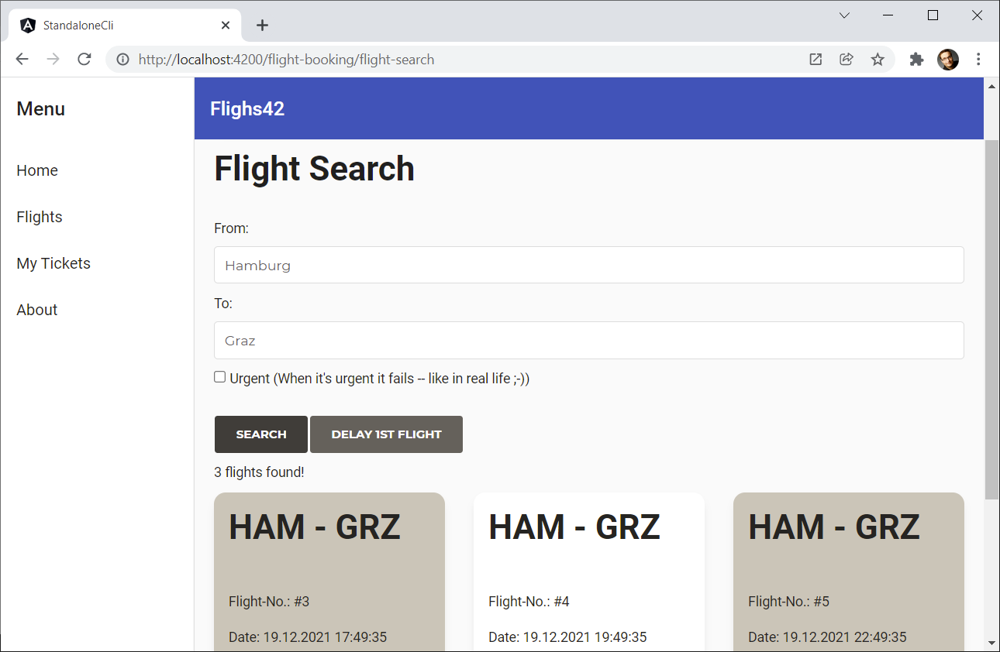

# Demo Project for Standalone Components using a CLI Project

Shows the upcoming idea of Standalone Components in the context of a demo application. As Standalone Components are **not** available yet, this demo uses a [shim](https://stackblitz.com/edit/ng-standalone) provided by the Angular team. This shim is **not indented for production** usage.

## Features

This show case shows the following aspects:

- Bootstrapping a Standalone Component
- Routing with Standalone Components
- Lazy Loading
- Structuring the application via barrels and path mappings
- Standalone Pipes and Directives
- Interop between Standalone Components and NgModules
- Using existing libs like NGRX and Angular Material

## Preview

## Workarounds

Workarounds to make the shim work: In order to make this shim work, I had to switch to JIT in ``angular.json``. As the ``AngularCompilerPlugin`` is bypassed, in order to load templates, I had to tweak the webpack configuration using ``ngx-build-plus`` and to load the templates via require. Also, I had to disable several checks performed by TypeScript (e. g. strict mode).

